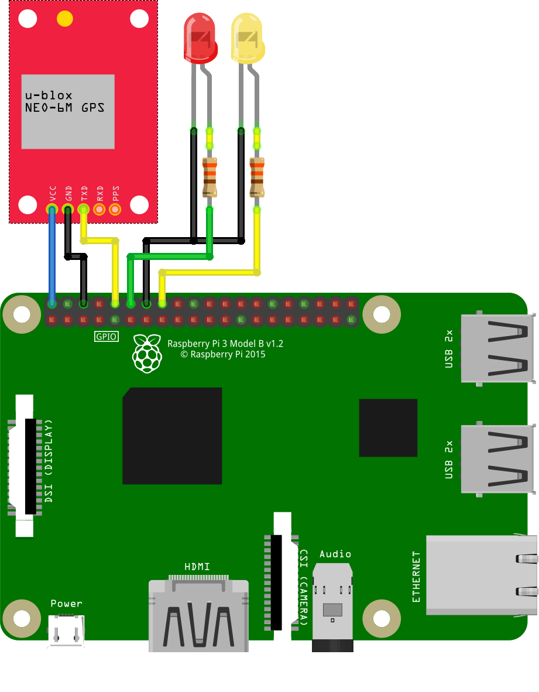

# How To: Wazihub and Raspberry Pi

This tutorial is about how to use the Wazihub platform for controlling a Raspberry Pi.

It covers these steps:
- Creating a new device on Wazihub
- Waiting for actuation to switch an LED on and off

# Prepare the Raspberry Pi

There are a few tools we need to bring up the platform:
- Go (Golang) https://golang.org/dl/
- Git https://git-scm.com/downloads
- MongoDB https://www.mongodb.com/download-center

After that, install the project files and dependencies:

```bash
$ go get github.com/julienschmidt/httprouter
$ go get github.com/globalsign/mgo
$ go get github.com/gorilla/websocket

$ go get periph.io/x/periph/conn/gpio
$ go get periph.io/x/periph/conn/gpio/gpioreg
$ go get periph.io/x/periph/host
$ go get periph.io/x/periph/host/rpi

$ go get github.com/j-forster/Wazihub-API
$ go get github.com/j-forster/Wazihub-API-Server
$ go get github.com/j-forster/Wazihub-Demo-RaspberryPi
```

Have a look at [Wazihub-Demo-RaspberryPi main.go](https://github.com/j-forster/Wazihub-Demo-RaspberryPi/blob/master/main.go). We will connect two LEDs to GPIO 18 and 23.

# Run it!

```bash
$ mongod &
$ go run github.com/j-forster/Wazihub-API-Server &
$ go run github.com/j-forster/Wazihub-Demo-RaspberryPi &
```

Copy the *DeviceId* from the log files, you will need it now.

To change the LEDs, use `devices/{deviceId}}/actuators/led1/value` and `led2`.

Use JavaScript to controll the LEDs:
On `fetch("devices/b8:27:eb:3b:a6:9e/actuators/led2/value", {method: "POST", body: "1"})`
Off `fetch("devices/b8:27:eb:3b:a6:9e/actuators/led2/value", {method: "POST", body: "0"})`
Or use any MQTT client, like [HiveMQ](http://www.hivemq.com/demos/websocket-client/):
Connect to the Raspberry Pi and Publish to `devices/b8:27:eb:3b:a6:9e/actuators/led2/value` values "0" and "1".

# Test it!

Run the go project with two simple commands:

```bash
$ go install github.com/j-forster/Wazihub-Demo-RaspberryPi
$ sudo ./go/bin/Wazihub-Demo-RaspberryPi
```

We need _sudo_ for LoRa communication (if needed).
Also have a look at the GPS implementation at [github.com/j-forster/MEKOB-P](https://github.com/j-forster/MEKOB-P).



## GPS

See [github.com/j-forster/MEKOB-P](https://github.com/j-forster/MEKOB-P).

## LoRa

Usage: [main.go#L150](https://github.com/j-forster/Wazihub-Demo-RaspberryPi/blob/master/main.go#L150)

Wrapper: [lora.go](https://github.com/j-forster/Wazihub-Demo-RaspberryPi/blob/master/lora.go)

## Bluetooth

Usage: [main.go#104](https://github.com/j-forster/Wazihub-Demo-RaspberryPi/blob/master/main.go#104)

Wrapper: [bluetooth.go](https://github.com/j-forster/Wazihub-Demo-RaspberryPi/blob/master/bluetooth.go)

The bluetooth wrapper is based on the bluetooth low energy tool _gatttool_.

In same cases, you need to terminate the gatttool to run this software properly: `sudo pkill gatttool`.

## Zigpos

See [github.com/j-forster/MEKOB-P](https://github.com/j-forster/MEKOB-P).

## LEDs

See the actuators at [main.go#L60-L75](https://github.com/j-forster/Wazihub-Demo-RaspberryPi/blob/master/main.go#L60-L75) and the declaration at [device.go#L35-L44](https://github.com/j-forster/Wazihub-Demo-RaspberryPi/blob/master/device.go#L35-L44)
